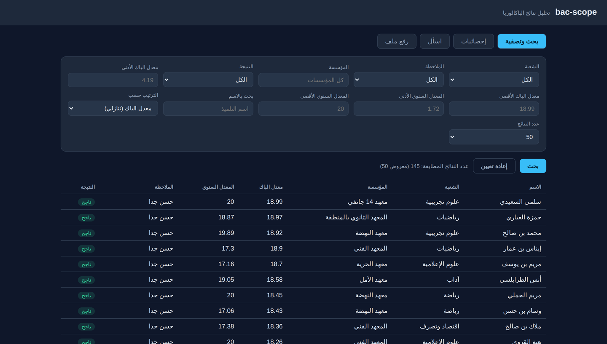
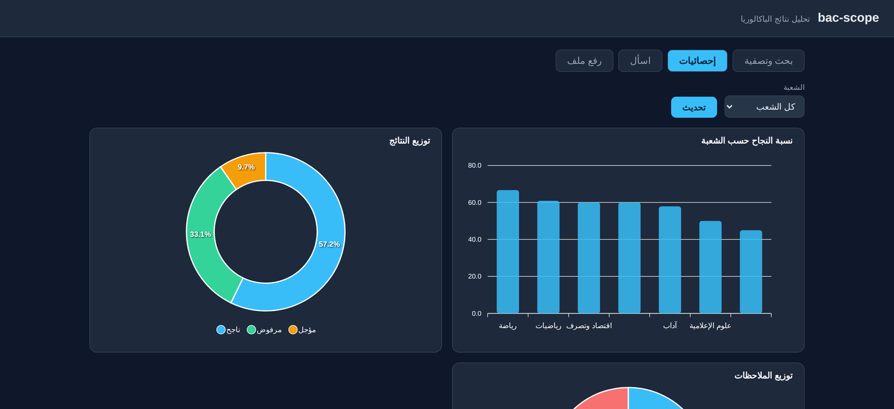

# bac-scope

[](https://github.com/Israaelhouch/bac-scope/actions/workflows/tests.yml)
[](https://www.python.org/downloads/)
[](LICENSE)

A backend API to query and analyze **Tunisian Baccalaureate results** — filters,
statistics, ready-to-render charts, and an Arabic **natural-language → SQL**
endpoint. Built with FastAPI + SQLite, API-first so any frontend can sit on top.

A demo web UI ships at `/` so you can try everything without writing a client.



**Status: complete.** All six build phases are done — data layer, core REST,
stats + charts, CSV upload, the `/ask` AI layer, and multi-format ingestion.
37 tests pass and the `/ask` eval suite scores 9/9. See
[`SOLUTION.md`](SOLUTION.md) for the design decisions and trade-offs behind it.

### What's interesting here

- **Arabic text-to-SQL** with schema linking — the prompt carries the live
  schema, a dialect glossary (`mou3adel` → `total`), real categorical values,
  and worked examples. Guarded by SELECT-only validation *and* a read-only
  connection, so the model can never write.
- **Measured, not assumed** — `/ask` is scored by *execution accuracy* against
  gold SQL, which caught a correlated subquery that looked right and wasn't.
- **Schema-free subject storage** — long-format grades absorb any new stream or
  subject without a migration.
- **Two CSV formats auto-detected**, with tatweel/diacritic normalization.

---

## Run it locally

From inside the `bac-scope/` folder:

```bash
# 1. (once) create a virtual environment and install dependencies
python3 -m venv .venv
source .venv/bin/activate          # Windows: .venv\Scripts\activate
pip install -r requirements.txt

# 2. (once) build the database from the CSVs in data/sample/
python -m scripts.seed

# 3. start the API
uvicorn app.main:app --reload
```

Or with the Makefile: `make install && make seed && make run`.

The repo ships an **anonymized sample dataset** (145 students across 7 streams),
so it runs out of the box — no data files to hunt down. Real student data is
never committed.

Then open:

- **http://127.0.0.1:8000/** — the **web UI**: tabs for filtering/search,
  statistics (charts), natural-language **اسأل**, and **رفع ملف** (upload a CSV).
- The server prints a clear "run `python -m scripts.seed`" banner (and `/health`
  reports it) if the database is missing or its schema is out of date.
- **http://127.0.0.1:8000/docs** — the interactive API docs (raw JSON, "Try it out").

> If the table is empty, the database hasn't been seeded — run
> `python -m scripts.seed` (step 2) and restart the server.

---

## Statistics & charts

Every `/stats/*` endpoint returns the raw numbers **and** a ready-to-render
ApexCharts spec, so a frontend draws a chart in one line or ignores the spec
entirely and builds its own.



---

## Endpoints

| Endpoint | What it returns |
|---|---|
| `GET /health` | Status + student count |
| `GET /filters` | **Selectable filter values**, cascading: pass current selection (e.g. `?stream=رياضة`) and each list narrows to values that still co-exist (faceted) |
| `GET /streams` | Each stream with count, pass rate, average |
| `GET /institutions` | Each school with count, pass rate, average |
| `GET /students` | Filtered, sorted, paginated list of students |
| `GET /students/{registration_number}` | One student + all their grades |
| `GET /stats/pass-rates` | Pass rate per `stream` or `institution` |
| `GET /stats/status` | Outcome breakdown — ناجح / مؤجل / مرفوض (optional `stream`) |
| `GET /stats/mentions` | Honor-grade distribution, passed students (optional `stream`) |
| `GET /stats/subject-averages` | Average grade per subject (optional `stream`) |
| `GET /stats/top-performers` | Top achievers; `per_stream`, `subject`, `by`, `limit` |
| `GET /stats/remontada` | Biggest gap of final total over annual average |
| `GET /datasets` | List of loaded CSV files (stream, rows, uploaded_at) |
| `POST /datasets` | Upload a CSV — auto-normalized and merged into the database |
| `GET /ask/status` | Whether the natural-language endpoint is enabled |
| `POST /ask` | **Natural-language question → SQL → result + auto-chart** |

### `/ask` — natural language (AI)

Send a question; the LLM writes SQL, the server validates it (SELECT-only,
single statement, enforced LIMIT) and runs it **read-only**, then auto-picks a
chart by result shape.

Optionally scope the question to a subset (soft-enforced via the prompt):

```
POST /ask
{ "question": "أفضل 5",
  "scope": { "stream": "رياضيات", "passed": true, "min_avg": 15 } }
```

```
POST /ask   { "question": "أفضل 5 معدلات في الرياضيات" }

{
  "sql": "SELECT name, moyenne FROM students WHERE stream='رياضيات' ORDER BY moyenne DESC LIMIT 5",
  "columns": ["name", "moyenne"],
  "row_count": 5,
  "data": [ ... ],
  "kind": "bar",            // stat | bar | table | empty
  "chart": { ...ApexCharts spec... }
}
```

**Enable it:** get a free key at https://console.groq.com, then in `.env`:

```
GROQ_API_KEY=your_key_here
GROQ_MODEL=openai/gpt-oss-20b     # optional — this is the default
```

Without a key, `/ask` returns `503` and the rest of the API works normally.

**Choosing the model.** Providers retire model IDs without much warning — the
original default here stopped resolving mid-project and took `/ask` down. So the
adapter doesn't trust a single ID: on `model_not_found` it asks the account which
models it can actually use and retries with the best available, reporting that
list instead of a bare 404.

Which model to prefer is then a measurement, not a guess. The eval harness scores
any candidate:

```bash
python -m scripts.eval --list-models              # what this key can use
python -m scripts.eval --model qwen/qwen3.6-27b   # score a candidate
```

| Model | Execution accuracy | Note |
|---|---|---|
| `openai/gpt-oss-20b` | **9/9** | **default** — same accuracy, cheapest and fastest |
| `openai/gpt-oss-120b` | 9/9 | 6× the size for no measurable gain here |
| `qwen/qwen3.6-27b` | 9/9 | needs `<think>` stripping, handled in the adapter |
| `allam-2-7b` | 2/9 | Arabic-native but too small — emits invalid SQL |

The last row is the interesting one: an **Arabic-specialised** model does *worse*
at Arabic text-to-SQL than a general model, because the hard part is the SQL, not
the Arabic. The schema-linking prompt is what carries the language.

Benchmarking also exposed three bugs in this repo — a gold query that dropped
tied students, a comparison that punished correct answers for returning an extra
column, and reasoning-model output that tripped the SQL validator. All three are
fixed; the tie case became a prompt rule (`RANK()`, not `ROW_NUMBER()`) that took
every model from 8/9 back to 9/9.
Safety: the LLM only proposes SQL; writes are blocked by validation **and** by a
read-only database connection.

**Every `/stats/*` response has the same shape:** raw `data` plus a full
**ApexCharts** spec.

```json
{
  "data":  [ { "group_name": "رياضيات", "pass_rate": 81.5, ... }, ... ],
  "chart": {                                  // a full ApexCharts options object
    "chart":  { "type": "bar", "height": 330 },
    "series": [ { "name": "نسبة النجاح %", "data": [81.5, ...] } ],
    "xaxis":  { "categories": ["رياضيات", ...] },
    "title":  { "text": "نسبة النجاح حسب الشعبة" }
  }
}
```

- Render the chart directly:
  `const c = new ApexCharts(el, resp.chart); c.render();`
- Or ignore `chart` and build your own visual / table from `data`.

> The backend produces the chart spec; the frontend only renders it. Frontend
> uses **ApexCharts** (`npm i apexcharts` or `react-apexcharts`).

### `/students` filters (combine any)

| Param | Meaning | Example |
|---|---|---|
| `stream` | Stream (شعبة) | `stream=رياضيات` |
| `institution` | Exact school name | `institution=معهد بوعرقوب` |
| `status` | Outcome: ناجح / مؤجل / مرفوض | `status=مؤجل` |
| `mention` | Honor grade (passed only) | `mention=حسن جدا` |
| `passed` | Passed (ناجح) only — for pass-rate | `passed=true` |
| `min_bac` / `max_bac` | **Bac average** range — معدل الباك (`total`) | `min_bac=15` |
| `min_annual` / `max_annual` | **Annual average** range — المعدل السنوي (`moyenne`) | `min_annual=12` |
| `search` | Name contains | `search=محمد` |
| `sort` | Sort field, `-` = desc (`total`, `moyenne`, `name`, …) | `sort=-total` |
| `limit` / `offset` | Pagination | `limit=20&offset=40` |

> **Two averages, kept distinct:** `total` = معدل الباكالوريا (the final bac
> average, determines pass/mention) and `moyenne` = المعدل السنوي (annual average).
> Plain "معدل" means `total`. Both are filterable, sortable, and aggregated
> (`avg_bac` / `avg_annual` on `/institutions` and `/streams`).

### `/institutions` params

`stream` (restrict to one stream), `min_count` (min students per school),
`sort` (`-pass_rate`, `count`, `avg_moyenne`, `institution`).

### Example requests

```
# Top 5 students in math with average >= 15
GET /students?stream=رياضيات&min_avg=15&sort=-moyenne&limit=5

# Best-performing schools with at least 10 students
GET /institutions?sort=-pass_rate&min_count=10

# Search a student by name
GET /students?search=محمد

# Upload a new stream/year CSV (multipart form: file + optional stream)
curl -F "file=@results_2026.csv" -F "stream=رياضيات" http://127.0.0.1:8000/datasets
```

Two CSV formats are auto-detected:

1. **Arabic format** — Arabic headers (`رقم التسجيل`, `الاسم`, `النتيجة`, …),
   one column per named subject (the original files).
2. **Export format** — English headers (`registration_number`, `student_name`,
   `section`, `result_status`, `overall_grade`, `annual_average`) followed by a
   variable number of `grade_N` / `subject_N` pairs.

Both are normalized the same way (tatweel + diacritics stripped, subject/stream
names canonicalized). Rows without a name, or files matching neither format, are
rejected. Re-uploading a student (same registration number) updates the record.

---

## Tests

```bash
pytest            # unit + API integration tests (runs on an isolated temp DB)
```

Covers ingestion parsing, subject normalization, SQL validation (SELECT-only,
limit injection, write rejection), the auto-viz chooser, and the API endpoints
(filters, cascading, stats shape, status, upload validation).

## Evaluating /ask (text-to-SQL accuracy)

A regression suite measures `/ask` by **execution accuracy**: each case has a
question + a known-correct "gold" SQL; the runner generates SQL from the
question, runs both read-only, and compares the *results*.

```bash
python -m scripts.eval          # real run — needs GROQ_API_KEY in .env
python -m scripts.eval --mock   # offline: verifies the harness + gold SQLs
```

Cases live in `evals/cases.py` and double as regression tests — each guards a
fix we made to the prompt (e.g. معدل→total not AVG, no spurious status filter,
correlated-subquery aliasing). When a real question comes back wrong, add it as a
new case, fix the prompt, and re-run until accuracy is back to 100%.

## Project layout

```
app/          FastAPI app — routers, ingestion, charts, NL→SQL, auto-viz
scripts/      seed.py (full rebuild) and eval.py (text-to-SQL accuracy)
evals/        gold question→SQL cases for the /ask regression suite
tests/        37 unit + API integration tests
web/          the demo UI served at /
data/sample/  anonymized dataset, committed so the project runs out of the box
```

## Notes

- The database (`data/bac.db`) is generated by the seed script and is gitignored.
- Override the DB location with the `BACSCOPE_DB` environment variable.
- All read endpoints use a read-only SQLite connection.
- Real student data is never committed — only the anonymized sample.

## License

[MIT](LICENSE)
